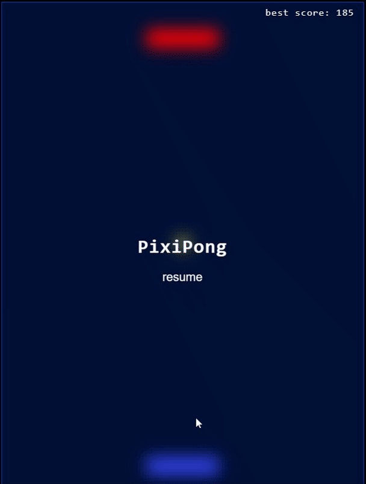

# pixi-pong :video_game:
A simple Pong game write with pixi.js lib.

## TODO :green_book:
Todo list for the game.

:white_check_mark: Smothed player paddle move.

:white_check_mark: Sound effects (ball collide player paddle)

:black_square_button: Enhanced sound effects.

:white_check_mark: Xbox gamepad support.

:white_check_mark: Xbox gamepad vibration support.

:black_square_button: Dualshok gamepad support.

:black_square_button: Dualshok gamepad vibration support.

:black_square_button: Enhaced dificult. (have no any difficult for now)

:black_square_button: More visual effects. Make game beautiful.

